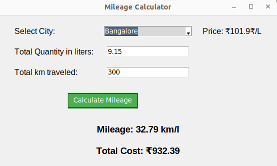

# Mileage and Fuel Cost Estimation Application

## Overview

This is a simple GUI application built using Tkinter in Python for calculating mileage and estimating fuel costs based on user inputs such as city, total quantity in liters, and total distance traveled.

## Features

- Select a city from the dropdown menu.
- Input the total quantity of fuel in liters.
- Input the total distance traveled.
- Click the "Calculate Mileage" button to see the estimated mileage and total fuel cost.

## Prerequisites

- Python 3 installed on your machine.
- Required Python packages installed. You can install them using:

    ```bash
    pip install tkinter requests pandas
    ```

## How to Run

1. Clone this repository:

    ```bash
    git clone git@github.com:jagadeeshreddyr/Mileage-Fuel-Cost-Estimation.git
    ```

2. Change into the project directory:

    ```bash
    cd mileage-fuel-cost-estimation
    ```

3. Run the application:

    ```bash
    python mileage_calculator.py
    ```

4. The GUI window will appear. Follow the on-screen instructions to use the application.

## Usage

1. Select a city from the dropdown menu.
2. Input the total quantity of fuel in liters.
3. Input the total distance traveled.
4. Click the "Calculate Mileage" button.
5. The estimated mileage and total fuel cost will be displayed.

## Example



## Dependencies

- [Tkinter](https://docs.python.org/3/library/tkinter.html): Python's standard GUI (Graphical User Interface) package.
- [Requests](https://docs.python-requests.org/en/latest/): Python HTTP library for making requests.
- [Pandas](https://pandas.pydata.org/): Data manipulation and analysis library.

## Acknowledgments

- Fuel price data sourced from [Economic Times](https://economictimes.indiatimes.com/wealth/fuel-price/petrol).


